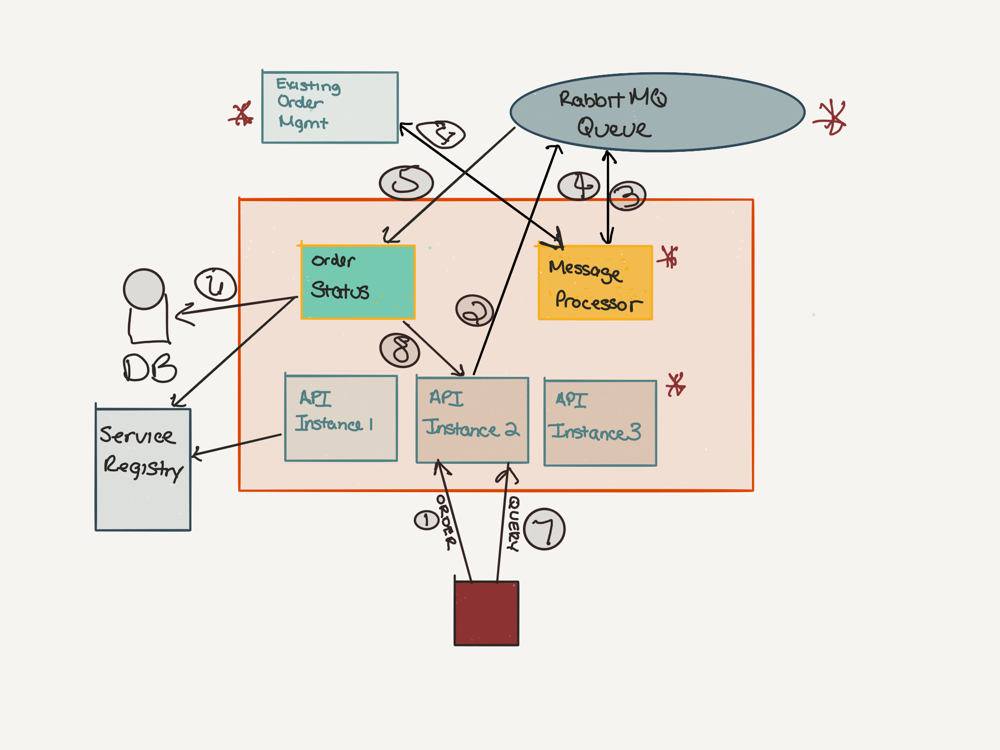

# Asynchrounous Order Processing Sample Application

This application demonstrates how to use microservices and a message broker for loose coupling and cloud native aspects.  It includes 5 microservices:

- [Legacy Order Management](./legacy-order-management) - Represents a legacy application that is abstracted by scalable and resilient microservices
- [Order API Frontend](./order-api-frontend) - A RESTful API frontend for submitting orders and querying their status
- [Message Processor](./message-processor) - A backend service for processing order messages, submitting them to the legacy order management system, and processing the results.
- [Order Status Service](./order-status-service) - A backend service for processing order completion messages, storing the status in a database, and providing a status query RESTful service.
- [Eureka Server](./eureka-server) - A service registry for discovering service endpoints.

These microservices also use cloud-native techniques such as circuit breakers, user-provided service bindings, and autoscaling.

## Running

### Local

Many of the microservices require a RabbitMQ instance.  Install RabbitMQ on your local machine (i.e. on Mac `brew install rabbitmq`).  If you're not using the default host / port / user / password of localhost / 5672 / guest / guest, then update the application.properties in `order-api-frontend`, `message-processor`, and `order-status-service`.

Each microservice is a Spring Boot application that is built with Maven.  Each microservice has a unique port assigned in it's `application.properties` file. Each microservice can be started with the command `mvn clean package spring-boot:run` in it's root directory.  You need to start the [`eureka-server`](./eureka-server) application first, and then you can start the other ones in any order.

### Pivotal Application Service

There are scripts in this directory to create the required service instances and deploy the applications.  Ensure that the following PCF services are installed:

- Pivotal MySQL
- Pivotal RabbitMQ

There is a user-provided service called `service-registry` that has the URL for the Service Registry.  Adjust the value in the `create-user-provided-service` command for the `service-registry` service in the `create-services.sh` script for the right URL.

There is also a user-provided service called `legacyorderservice` that has the URL for the Legacy Order Management service.  Adjust the value in the `create-user-provided-service` command for the `legacyorderservice` service in the `create-services.sh` script for the right URL.

Ensure that you are logged into PCF and targeted to your org and space.  Then run the scripts `create-services.sh` and `deploy-apps.sh`.

## Architecture
The following diagram shows the high-level architecture of the application:

## URLs

You can use curl, Postman, or any other REST HTTP client to invoke the various services.  The following can be invoked via HTTP.

Placing an order (i.e. from mobile client):

`
POST <order-api-frontend>/order
body = {"message": "testing orders"}
`

Query order status from front end (i.e. from mobile client):

`
GET <order-api-frontend>/order/<id>
`

Query order status from order status server:

`
GET <order-status-service>/order/<id>
`

## Walk through

The following are capabilities that you can demonstrate in the application:

- __Circuit breaker pattern__: Shutdown `order-status-service` and hit `<order-api-frontend>/order/<id>` to show the fallback message
- __Legacy app resiliency__: Shutdown `legacy-order-management` and tail logs from `message-processor` to show that messages are still in the queue until the backend system returns.  You can also view the messages in the RabbitMQ managment UI.
- __Service registry / discovery__: Show the Service Registry console and the registered endpoints.  Scale the Order API Frontend app to multiple instances and show that they're registered in the Service Registry.
- __Asynchronous messaging__: RabbitMQ is used as a message broker for orders and statuses.  This ensures loose coupling and non-dependency between legacy systems and microservices.
- __External configuration__: The `message-processor` microservice uses a user-provided service in PAS for the `legacyordermanagement` service URL.  There is a custom `ConfigurationProperties` class in `message-processor` that returns this user-provided service value, or a default value if it doesn't exist.  You can also set a local environment variable named `VCAP_SERVICES_LEGACYORDERSERVICE_CREDENTIALS_URL` with the value instead of using the hard-coded default value.  Either way, Spring Boot takes care of resolving it.
- __Spring Boot__: Used for all of the microservices.  Each microservice is very small (<100 lines of code typically), and this whole system was built in less than a day.  Boilerplate stuff like messaging and CRUD operations are implemented with less than 5 lines of code.
- __Scaling API for load__: Turn on autoscaling for the `order-api-frontend`, use a load testing tool like JMeter, and demonstrate how peak requests can be handled automatically.  Also note that the orders are processed asynchronously, by encapsulating the legacy system.
- __Microservices__:  The application is comprised of several microservices, each independently versioned, deployed, and scaled.  They are all decoupled through well defined contracts (REST APIs and messages).
